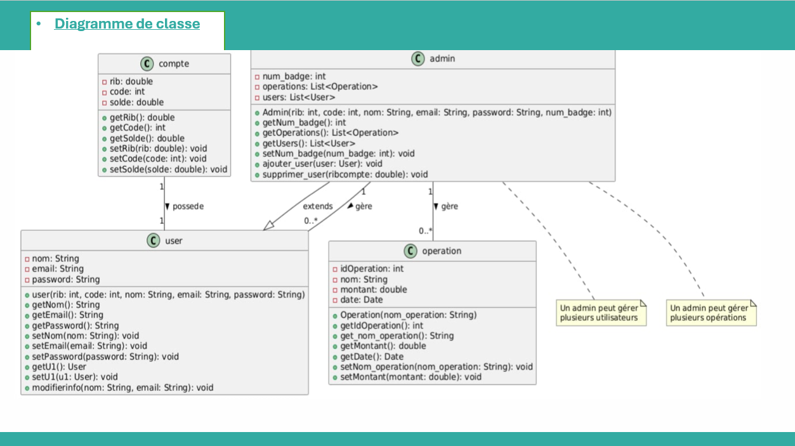
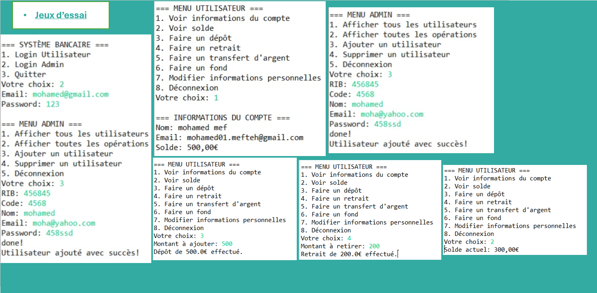

Project : Banking Management System

Objective
A software product which provides solution for Banking Management System (deposit,
withdraw, view balance, ...)
The user can view balance, account information, operations (deposit, withdraw), ...
Admin can add and delete account, operation (deposit, withdraw), ...
Users of the System
Admin
Users
Functional Requirements
1. Admin
Can login and logout.<br>
Can add Account → Hashmap or ArrayList<br>
Can add operation(deposit, withdraw)→ Hashmap or ArrayList<br>
Can view balance<br>
Can delete Account<br>
Can delete operation<br>
2. User<br>
Can view Balance<br>
Can view personal information<br>
Can modify personal Information<br>
Can list operations (deposit, withdraw)<br>
***The project is OOP so we created a class diagram :***

***this is a breif trial for the code :***

To get started, you'll need to clone this repository to your local machine and run the Java file. Follow these steps:

1. **Clone the Repository**: Open a terminal and run the following command to clone the repository:
   ```bash
   git clone https://github.com/mouhamedmef/bank-management-system.git
